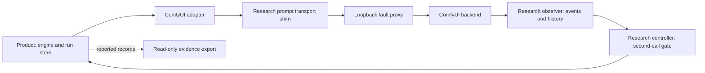

> v0.4 continuation: the active manuscript is `paper/main.tex` and `paper/main.pdf`.
> This document preserves the v0.3 planning/audit snapshot. Current evidence
> disposition and review are in `paper/evidence/` and `paper/review/ARS_REVIEW.md`.

# Evidence-Bound Recovery for Ambiguous Submissions in Local Generative-AI Pipelines

Working manuscript v0.3 — DSN Tool Description — 2026-09-27

> Internal, evidence-bounded draft. Source baseline:
> `5cd100f2b4a4a7aaeac1fd707fc248bae46f239c`. Windows results below are
> checked against the retained Windows campaign-report fields. Backend events
> have not been independently reconstructed and image bytes remain unchecked. Internal tags refer
> to the [claim matrix](dsn-tool-description-claim-evidence-matrix.md) and
> [gap register](dsn-tool-description-evidence-gaps.md); retain them until closed.

## Abstract

A lost submission response can leave a local image-generation client uncertain
whether its backend accepted or executed a request. Retrying under that
uncertainty requires distinguishing client status from backend observation.
We describe evidence-bound recovery tooling for `local-gpu-imagegen`: a
versioned evidence exporter, a conservative guard on further submissions
through an unresolved run, and controlled fault injection with execution
observation. The exporter preserves reported state separately from
interpretation and oracle evidence. The guard retains an explicitly unknown
submission outcome without inventing a job identifier or an automatic
reconciliation result. A deterministic CPU harness exercises response-loss
semantics. A recorded Windows/ComfyUI campaign made four fixed F00/F02 cases
oracle-evaluable. Each normal control had one submission and one observed
execution; each injected case had an unresolved first call followed by a
resolved second call, with two submissions and two observed executions. The
second call created a fresh run after observed completion and used a different
seed. These observations demonstrate bounded execution visibility, not recovery
of the original run or fewer executions under W3. The tool supports inspection
of ambiguous outcomes within an explicit evidence contract; deployment failure
rates, natural duplicate-execution rates and output-quality improvement remain
unmeasured.

## 1. Introduction

Consider a client that submits an image-generation workflow and loses the
response after the backend accepts it. The backend may continue while the
client lacks the returned job identifier. A second submission creates another
opportunity for execution, but a timeout or a count of HTTP requests cannot
establish what the backend actually did. The relevant question is which
observations justify the next recovery action and the subsequent report of
that action.

Uncertain outcomes are an established distributed-systems problem. Remote
procedure call designs distinguish call semantics under communication failure
[1], while idempotent API designs use caller-provided identifiers and explicit
service behavior to make retries safe [2]. A local workstation does not remove
the distinction between request transmission and backend execution. Our tool
addresses how that distinction is represented and inspected in a particular
local generation pipeline; it does not introduce a new exactly-once protocol.

`local-gpu-imagegen` combines persistent run records, generation orchestration,
a ComfyUI adapter and artifact handling. We describe tooling that preserves the
client's evidence, applies versioned interpretation rules, and records backend
observations independently of the client's returned status. Its product guard
is deliberately narrower: an explicitly unknown submission blocks further
submission through the same unresolved run at the reviewed entry points.

The tool description has three parts: an evidence representation and read-only
exporter; a same-run guard whose unresolved state remains visible; and CPU and
Windows fault-observation workflows with separate evidence boundaries. The
Windows demonstration tests visibility across the client–backend boundary.
It does not establish that the guard reduces execution counts in that protocol.
The contribution is an inspectable integration of evidence interpretation,
run-scoped control and backend observation. Section 6 compares its scope with
idempotent APIs, workflow execution and tracing. An exhaustive nearest-tool
review remains open; no first-of-its-kind claim is made. `[CITE-GAP:G04]`

## 2. Failure model and evidence semantics

A **product call** is an invocation by the research client. A **run** is the
persistent product object created by `local_gpu_start_run`. A **submission** in
the Windows results is a proxy-observed `POST /prompt`; a call that fails before
that boundary need not produce a submission. An **execution instance** is an
observation bound to backend execution events. CPU fixtures instead observe
the synthetic worker entry. These units are not interchangeable.

F00 is a normal control. F02 suppresses the first accepted submission response,
creating a window in which the client lacks an acknowledged job identifier.
F03, covered by the CPU fixtures rather than the Windows campaign reported
here, concerns loss of completion information after a job identifier is known.
An explicit rejection and a missing response have different evidential meanings.
Neither should be silently converted into a backend execution outcome.

The evidence model distinguishes reported state, interpreted state and oracle
state. In addition, the Windows research client emits its own call-level labels.
Its `resolved` label is derived from a generated product result after checking
for artifact hashes. Its `unresolved` label can arise from several client errors.
Thus a research-client label alone does not prove that a durable product
manifest has a particular recovery state. In F02, the proxy's accepted-response
loss and the oracle binding provide the additional context. `[SCOPE:C11]`

## 3. Tool design

### 3.1 Evidence-preserving export

The exporter accepts a record or run manifest and produces a separate normalized
record. It copies reported state, records the mapping version and reasons, and
retains supplied oracle state separately. The schema includes source identity,
request and input digests, backend identity, job identifier, artifact hash and
validator version. Missing fields carry explicit reasons instead of fabricated
values. The inspected mapping is `research-normalization-v2`.

Interpretation checks more than an execution-success label. Job and artifact
bindings, approval and validation evidence, and recovery state constrain the
`execution_verified` decision. An unresolved recovery state prevents this flag
from becoming true even when other evidence reports successful execution.
This permits the record to express backend completion without asserting that
the product's recovery obligation has been discharged. The exporter does not
invoke the engine, retry a request or update the source run. Its output writer
uses exclusive file creation. These are implementation properties, not a
claim of complete filesystem security. `[SCOPE:C01–C02]`

### 3.2 Recovery guard and its scope

`AssetRunEngine` and `RunStore` preserve the explicit transport marker
`submission_outcome=unknown` as an unresolved attempt. The reviewed submission
entry checks that unresolved attempt before permitting further generation.
The guard applies within the same run, including attempts with a different
idempotency key. The corresponding inspection action is `get_run`.

This guard does not discover a missing backend job identifier or reconcile an
unknown job automatically. A newly created run lies outside the prior run's
guard. Existing recovery for a known job in a two-stage operation is a separate
path and is not attributed to this no-job-ID guard. The resulting tradeoff is
explicit: the guard withholds another submission through that run while the
required evidence is unavailable; it does not guarantee eventual completion.
`[SCOPE:C03–C05]`

### 3.3 Controlled observation on Windows

The research harness adds a transport shim and loopback fault proxy. The shim
routes prompt transport through the proxy while retaining the actual backend
endpoint in the product's identity client. F02 drops the first response only
after backend acceptance. This arrangement is a research instrument, not a
native ComfyUI recovery feature.

The observer connects before the product invocation and uses the operation key
as its ComfyUI client identifier, matching the product's event-routing identity.
`ComfyUIEventOracle` requires an execution-start event, a terminal event and
completed history bound to a prompt identifier. It derives an execution-instance
identifier using the backend boot identity, prompt identifier and observed
start sequence. Its independence is from the product return value: it still
trusts the backend's event and history interfaces, and it is not a physical GPU
monitor or a crash-durable audit log.

The controller permits the second F02 product call only after the first
execution has a bindable completion. The client creates a new run on each call
and uses `seed = 4100 + call_index`. This is observation-gated fresh-run
generation, not automatic reconciliation of the original run. Matching frozen
request digests does not establish full prompt equality: the inspected digest
function excludes the seed and does not use its plan argument.
`[SCOPE:C12–C16]`

Figure 1. Product and research components. The controller's second invocation
creates a fresh run. The diagram describes component roles, not an assertion
that a complete normalized Windows evidence bundle has been released.

## 4. Evidence and demonstration

### 4.1 CPU components and deterministic fixtures

The CPU harness separates submission events from synthetic worker-entry events.
Its fixtures cover normal operation and response loss before and after job-ID
acquisition, including single-stage and two-stage paths. Oracle self-checks
exercise cases in which submission and execution counts differ and in which a
shared prompt identifier does not imply a single execution. These are fixed
semantic checks, not randomly sampled deployments.

Historical command output records 40 research component tests passing in
7.110 seconds using `py -3.15 -B -m unittest discover -s tests\research -v`,
with `OK` and exit code 0 [E4]. The preparation report identifies the runtime
as Windows Python 3.15.0a8 [E2]. A later macOS check targeted the transport shim
and campaign controller: seven tests passed in 0.003 seconds, followed by
successful compilation and whitespace checks [E4]. These are distinct stages;
the earlier 40-test result is not a full-suite result for the final shim.
Neither count is an experimental sample size. Exact immutable source binding
of the historical test worktrees remains incomplete. `[EVIDENCE-GAP:G02]`

Earlier paired CPU results are documented separately [E3]. They must not be
pooled with the Windows cases: the synthetic same-run path and the fresh-run
Windows client do not exercise the same recovery scope.

### 4.2 Four controlled Windows cases

The endpoint-preserving campaign report [E1] records B2 and W3 under F00 and
F02. All four fixed cases were oracle-evaluable; the two F00 cases were controls
and the two F02 cases had confirmed response-loss injection. Table 1 reports
the observations without converting these counts into a success probability.

| System | Case | Product calls | Proxy submissions | Observed execution instances | First call | Second call | Oracle-evaluable |
|---|---|---:|---:|---:|---|---|---|
| B2 | F00 | 1 | 1 | 1 | resolved | — | yes |
| W3 | F00 | 1 | 1 | 1 | resolved | — | yes |
| B2 | F02 | 2 | 2 | 2 | unresolved | resolved | yes |
| W3 | F02 | 2 | 2 | 2 | unresolved | resolved | yes |

Table 1. Observations for four predetermined cases [E1], cross-checked against
the retained campaign-report fields [E4]. Call
labels are research-client classifications; the F02 second call is a new run
with a changed seed. Execution instances are backend-event bindings, not counts
inferred from POSTs. The campaign totals are six calls, six submissions and six
observed execution instances. No rate is estimated. `[EVIDENCE-GAP:G03]`

The report identifies an RTX 5070 Ti Laptop GPU and ComfyUI v0.30.0 at commit
`b1693ecba9f5b65f8c80ab36b195ab963ec92413`, with pinned model and workflow hashes
checked against the campaign configuration. These are recorded environment
facts for this campaign. They do not establish behavior across other models,
backend versions or machines.

Both systems produced two observed executions in F02. This demonstrates that
the research observer could retain execution evidence despite the first call's
ambiguous outcome. It does not demonstrate an execution-count advantage for W3.
Because the second call changed run and seed, the table also does not establish
a duplicate execution of an identical generation request.

### 4.3 Resolution labels require an explicit aggregation rule

A resolved second call does not erase the first call's unresolved result or
show that its original run was reconciled. Read-only inspection of the retained
campaign report [E4] confirmed that both F02 records carry `resolved=1` and
`unresolved=1`. These are independent any-call flags: across the four cases,
`resolved` sums to four and `unresolved` to two. They are overlapping counts,
not mutually exclusive outcomes. The earlier Markdown summary's zero unresolved
cases is therefore not the controller aggregation. Table 1 preserves the call
sequence; the evidence addendum records this correction without rewriting the
historical report. No recovery-success rate is inferred.

There is also a counting distinction within the observer export. Successive
oracle decisions retain cumulative raw-event snapshots, so summing their event
counts can count earlier events again. The controller's execution count uses
distinct bound execution-instance identifiers. A raw-evidence audit must check
those bindings, not substitute aggregate event counts. `[EVIDENCE-GAP:G03]`

## 5. Reproducibility and limitations

The versioned source and campaign reports allow inspection of the protocol and
its boundaries. The frozen product identities in [E1] are B2
`da65d57047b5a59e3403b49adf4605a1c0497c58` and W3
`d45173af75d404ad79dc14568edd4c45f654abd2`. They are distinct from the research
source/report baseline `5cd100f2b4a4a7aaeac1fd707fc248bae46f239c` used for this
revision. Reproducibility requires preserving that distinction.

The CPU source includes test modules under `tests/research`; an intended
component-check entry point is `python -m unittest discover -s tests/research`.
This command has not been executed in this writing revision and must not be
assumed to reproduce the historical count of 40. Exact environment/dependency
capture and clean-checkout reproduction remain open. `[EVIDENCE-GAP:G02,G05]`

Raw Windows campaign JSONL, private configurations, model files and generated
images remain Windows-local according to [E1]. Read-only follow-up
inspected the retained campaign-report fields and computed its file hash [E4].
This did not independently reconstruct raw WebSocket events or verify image
content. A sanitized
per-call event/history manifest and its binding checks are still required for
independent inspection of Table 1. The availability of source and a summary
is not equivalent to a complete distributable reproduction package.
`[EVIDENCE-GAP:G03,G05]`

Artifact evidence has its own boundary. The research client computes content
hashes for returned artifacts, whereas oracle-exported path fingerprints hash
metadata strings. A path fingerprint is not a content hash. Completed backend
history and a content hash do not establish visual quality, task acceptance or
finalization. Earlier protected-pixel or mask-validation results from a
different pilot are not imported into this campaign. `[EVIDENCE-GAP:G06]`

Observation depends on receiving and binding backend events within the harness
window. Missing events limit evaluability; they do not establish non-execution.
The same-process CPU observer and backend-origin Windows observer have different
failure boundaries, neither of which establishes crash-complete auditability.
The fixed case set contains no basis for deployment failure frequency, natural
duplicate-execution frequency, performance improvement or broad model
robustness. No GPU run, model download or new experiment was performed for this
manuscript revision.

## 6. Related work and discussion

RPC failure semantics provide the conceptual starting point: a failed
communication does not necessarily settle whether a remote operation ran [1].
Idempotent API design addresses safe retries through an explicit contract,
including caller-provided request identifiers [2]. Our tool relies on neither
a prompt identifier nor a client idempotency key as sufficient evidence of
backend deduplication. Its role is to preserve and qualify observations when
such a guarantee has not been established for the evaluated path.

The practical distinction is between observation and control. Backend events
can establish that work completed while the client's original run remains
unresolved. Conversely, a conservative same-run guard can block a further
submission without resolving that uncertainty. The Windows harness crosses a
different boundary by creating a new run after observation. Keeping these
scopes separate explains why the demonstration can be oracle-evaluable without
showing automatic recovery or a W3 reduction in executions.

Temporal's Activity documentation describes the same lost-completion boundary:
a worker may finish an Activity and crash before reporting completion, leading
to a retry. It recommends idempotent Activities [3]. This is an important
comparison because durable workflow state alone does not eliminate uncertainty
about external side effects. Our same-run guard withholds a submission under
explicit uncertainty, but supplies no equivalent general workflow-execution or
automatic reconciliation guarantee.

OpenTelemetry represents operations through spans and uses trace context to
relate observations across a request [4]. Such correlation provides a useful
representation for a distributed execution path. In this tool, the additional
application-specific rule is which observations permit an execution claim:
backend start and terminal events must bind to completed history, and unresolved
product recovery can still veto `execution_verified`. Correlation identifiers
alone are not used as execution counts.

| Mechanism | Identity / observation | Recovery responsibility | Relation to this tool |
|---|---|---|---|
| Idempotent APIs [2] | Caller token under service contract | Service handles repeated intent | No such backend guarantee is established here |
| Temporal Activities [3] | Workflow/Activity execution and completion reporting | Retries require idempotent side effects | Our block is scoped to an unresolved product run |
| OpenTelemetry traces [4] | Instrumented spans and trace context | Tracing describes operations | Our interpretation adds backend and artifact evidence conditions |
| Toxiproxy [5] | Configurable TCP proxy and connection faults | Application handles the induced failure | Our F02 injection selects an accepted-response boundary |
| This tool | Run records, proxy receipts, backend events/history | Same-run block; harness gates a fresh-run call | Unknown states remain explicit; no global deduplication |

Toxiproxy provides configurable TCP connection fault injection for testing [5].
Our research proxy uses an application-level acceptance condition to select
the response to suppress, while the observer separately checks execution. This
comparison does not show that Toxiproxy could not support an equivalent setup;
no comparative implementation or usability measurement was performed.

This is a documentation-based comparison of responsibilities, not a performance
benchmark or a feature-absence survey. The practical contribution is making the
relationship between client ambiguity, backend observation and permitted claims
inspectable for a local generation workflow. A broader academic and
reconciliation-system nearest-work comparison remains incomplete.
`[CITE-GAP:G04]` No superiority or exhaustive novelty claim follows from the
selected sources.

## 7. Conclusion

The tool preserves ambiguous client outcomes alongside separately bound
execution evidence and implements a conservative guard within an unresolved
run. The controlled Windows cases demonstrate execution visibility under lost
acceptance responses, while exposing the distinction between a new successful
call and reconciliation of the original run. These bounded observations support
an evidence-preserving tool description. They do not establish automatic
unknown-job recovery, deployment-wide reliability or natural duplicate-execution
rates.

## References verified for this draft

[1] Andrew D. Birrell and Bruce Jay Nelson. “Implementing Remote Procedure
Calls.” *ACM Transactions on Computer Systems* 2(1), 39–59, 1984.
[Primary paper](https://www.cs.cmu.edu/~15712/papers/birrell84.pdf).

[2] Malcolm Featonby. “Making retries safe with idempotent APIs.”
*Amazon Builders’ Library*.
[Authoritative article](https://aws.amazon.com/builders-library/making-retries-safe-with-idempotent-APIs/).

[3] Temporal Technologies. “Activity Definition,” sections on idempotency.
[Official documentation](https://docs.temporal.io/activity-definition).

[4] OpenTelemetry Authors. “Traces.”
[Official documentation](https://opentelemetry.io/docs/concepts/signals/traces/).

[5] Shopify. “Toxiproxy.” Official project README.
[Project documentation](https://github.com/Shopify/toxiproxy).

Sources were accessed for this writing revision on 2026-09-27. They are
conceptual references, not evidence for this implementation's measured behavior.
The bibliography is incomplete under G04; target-year DSN formatting is pending
under G05.

## Internal evidence references

- [E1: endpoint-preserving Windows campaign](runs/w3-windows-f02-endpoint-shim-20260927.md).
- [E2: historical 40-test provenance and earlier blocked campaign](runs/w3-windows-f02-retry-20260927.md).
- [E3: historical component and paired-CPU evidence map](dsn-claim-evidence-map.md).
- [Current claim matrix](dsn-tool-description-claim-evidence-matrix.md).
- [Evidence gaps and change rationale](dsn-tool-description-evidence-gaps.md).

- [E4: retained report and historical test reconciliation](dsn-evidence-reconciliation-20260927.md).
