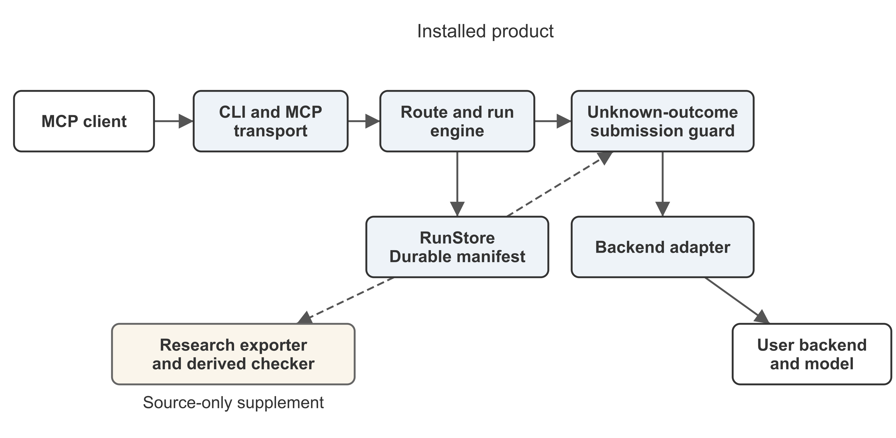
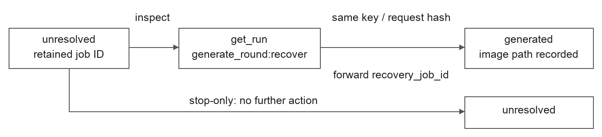

# Local GPU Imagegen: Durable run records for local image generation

Zhen Cheng

School of Computer Science and Technology (School of Artificial Intelligence), Zhejiang Sci-Tech University, Hangzhou, China

Correspondence: ChengZhen0105@outlook.com

## Abstract

Local GPU Imagegen is an open-source Python control plane for local image-generation workflows. Its Model Context Protocol interface exposes durable run records, frozen execution routes and explicit submission uncertainty. Six fixed paired Windows operations illustrate its ComfyUI submission guard. After accepted response loss, the guard retains one accepted job but leaves the original client run incomplete; a pre-send failure also produces a false block. A synthetic stop-after-unknown control matches the reported outcomes. Source-based checks distinguish backend acceptance, execution lifecycles and client completion. The software provides an inspectable integration of these interfaces and records, with raw captures remaining private for this study.

Keywords: research software; Model Context Protocol; ComfyUI; durable run records; submission uncertainty; local image generation

## Software metadata

| Item | Candidate value |
|---|---|
| Software name | Local GPU Imagegen |
| Current package version | 0.9.1 |
| Source repository | https://github.com/ChevalGrand520/local-gpu-imagegen |
| Source snapshot | dfc8378cb3d891f7951786bc4544cd971bd56a11; immutable GitHub commit link |
| Paired experiment source | 08539d5; distinct from the draft input |
| License | MIT |
| Implementation language | Python |
| Declared Python requirement | >=3.11; CI matrix uses Python 3.11 and 3.12 |
| Supported product platform | Windows; Ubuntu CI is software test coverage, not retained GPU generation evidence |
| Package dependency | py7zr==1.1.3; backend, model and workflow requirements are separate |
| Main interface | local-gpu-imagegen CLI and stdio MCP server |
| Documentation | Repository README.md and docs/ |
| Research supplement | scripts/research/export_records.py in the source checkout; excluded from the wheel and sdist |
| Permanent software archive | Not yet selected for this candidate |

## 1. Motivation and significance

Local image-generation clients select workflows, submit parameters, inspect progress and retrieve images through backend adapters. Product calls, adapter sends, backend acceptance, execution and client completion are separate events. A failed response does not necessarily imply that no backend job exists. Retaining those distinctions is necessary to inspect incomplete operations.

Remote procedure calls and idempotent API design explain why communication failures can make retries repeat an operation's effects [1,2]. In local image generation, a lost acceptance response can lead to another accepted job, while stopping after uncertainty can block completion even if nothing was sent. The engineering question is what the controller records and permits at this boundary.

Local GPU Imagegen provides a reusable control plane around local backends. It combines a thin MCP transport, explicit discovery and trust checks, a durable run engine and backend adapters. Li's simulated-service study evaluates a closely related guard that remembers unknown writes and refuses unverifiable repeats [3]. Our contribution is the concrete local image-generation integration and a limited characterization of submission withholding and incomplete client runs, including a pre-send false block. We introduce no new recovery policy and make no comparative efficacy claim. Li also identifies a verification-only limit without a known in-flight bound; that result provides context, but does not establish that our particular unresolved runs were unavoidable.

Effect-history models distinguish external events from runtime observations and identify the boundary capabilities needed to resolve ambiguous effects [4]. Verification-aware wrappers query task-specific postconditions before retrying and use server-side idempotency where available [5]. ToolPro instead records completed WRITE outcomes and replays them during program repair, under an effect-typed replay discipline [6]. These mechanisms require different information: a local unresolved record is neither an authoritative postcondition nor a recorded completed-write outcome. Local GPU Imagegen exposes that distinction in a ComfyUI integration. It does not implement ToolPro's program runtime or replace the verification and backend contracts studied in these works.

The intended reuse is in workflows needing explicit local backend selection and inspectable completion failures. Retained state supports investigation of an unresolved run; external adoption has not been measured.

## 2. Software description

### 2.1. Architecture

The MCP transport handles JSON-RPC, schemas, validation, dispatch, timeouts and structured results. Discovery, trust and capability routing precede execution. The run engine owns orchestration and delegates persistent state to RunStore. Backend loading and image generation are delegated to the generation module and its adapters. The repository includes ComfyUI and WebUI adapters and a Diffusers compatibility path; the retained paired experiment concerns ComfyUI only.

Figure 1. Local GPU Imagegen architecture. Solid arrows show control relationships; dashed arrows show retained-record access. The exporter and checker are source-only supplements; the backend and models are user supplied.

A durable manifest retains the selected route, submission state and outputs; immutable child runs preserve earlier revisions. Subsequent attempts validate the frozen route, reject drift and expose unresolved state for inspection.

The distribution does not bundle a GPU backend or model weights. A user supplies an appropriate local backend and reviews the workflow and model selection. The MCP process does not call an application-specific cloud image API. Confirmed LAN endpoints transmit prompts and source images to that server; loopback is local. Trust records remain outside Git, and model downloads require an explicit download option. Generated and input images remain ordinary local files whose directory permissions are the user's responsibility.

### 2.2. Software functionalities

For the evaluated same-run path, an unknown submission outcome prevents another automatic submission. The guard consults retained run state and returns an unresolved result. This withholding does not by itself identify an accepted backend job, reconcile its output or complete the client operation. It also does not provide backend-wide deduplication across arbitrary processes or newly created runs.

The guard acts on recorded uncertainty, which may arise even when no request reached the backend. Section 3 illustrates both withheld resubmission and its completion cost.

The ComfyUI adapter can poll `/history/<job_id>` when a backend job identifier is known, including its explicit recovery path. In the unknown-submission path, the response has not supplied a retained job identifier; the product does not automatically discover that missing identifier from backend history or establish whether an unbound request is in flight. `local_gpu_get_run` returns local retained state, rather than resolving backend acceptance. This implementation boundary explains what remains unknown in F02; it is not a general impossibility result for ComfyUI.

The product's idempotency key binds an attempt to its locally retained request hash. On submission, the adapter sends it as ComfyUI's `client_id`, not as an independently verified server-side deduplication contract. The tested integration therefore does not assume that repeated `/prompt` requests return one original outcome, as required for the key-enabled contracts in Li [3]. Retained-job history recovery and service-level idempotent resubmission are distinct mechanisms.

### 2.3. Inspection and interfaces

The installed CLI exposes serve, doctor, verify, config and setup contracts. The verify command checks the MCP interface; an isolated wheel installation reported version 0.9.1 and seventeen tools. That check establishes interface availability, not a complete image-generation workflow on the test machine.

The code and documentation links identify one immutable source snapshot, including README.md, Licence.txt, the product and research scripts. From that checkout's root, `python -m pip install .` installs the product and `local-gpu-imagegen verify` checks its interface. Version 0.9.1 also exists on PyPI, but that historical artifact is separate from the cited source snapshot. The README describes backend setup separately. From the checkout root, `python paper/scripts/verify_paired_projection.py` checks the included derived table without submitting a backend job. The checker and exporter require the source checkout and are absent from the product wheel. This example checks the accepted-job and completion distinctions in Section 3; it does not rerun the Windows campaign.

For an existing run, a client calls `local_gpu_get_run` with `{"run_id":"<existing-run-id>"}`. The response includes retained `state`, `request.route` and `attempts`, plus `recoverable_next_actions` computed during retrieval; the latter need not exist in the disk manifest. In the unknown-submission branch, the attempt has `status: unresolved` and `submission_outcome: unknown`, and the run has `state: unresolved`. Retrying that branch encounters `submission_outcome_unknown` before another send. Other unresolved attempts can retain a backend job without an unknown-outcome field. RunStore admits their recovery only with the matching idempotency key and request hash; the engine forwards `recovery_job_id` for its two-stage ComfyUI route, allowing the adapter to poll the retained job instead of posting again. This is a distinct path from the evaluated unknown-submission branch. The frozen `request.route` stores backend, endpoint/model identity and workflow/compiler versions for subsequent validation. Retrieval does not certify backend completion and can perform local stale-attempt recovery bookkeeping.

Research records can additionally be exported using scripts/research/export_records.py from the source checkout. Twelve synthetic offline probes, with no Windows or GPU execution, produced equal classifications for the exporter and a same-author field parser. Their fixture inputs are separate from the Windows capture bytes. The Python 3.13.15 receipt is paper/evidence/v022-probe-command-receipt.json in the cited snapshot. This comparison supplies no evidence of parser superiority or reduced audit effort.

## 3. Illustrative examples

### 3.1. Fixed paired protocol

The retained F02 guarded case illustrates a failed client operation from submission through inspection. The product submits the selected ComfyUI workflow; backend acceptance occurs, but injected response loss prevents retention of the returned job identifier. The observer records backend completion while the original client run remains unresolved and another same-run generation call is withheld. The client can inspect that local state through `local_gpu_get_run`, as described in Section 2.3, but retrieval cannot recover the missing identifier. This walkthrough combines the recorded outcome and source interface contract; it adds no later client session or recovery measurement. The B2 path repeats submission and completes, providing the contrasting outcome in Table 1.

The corrected Windows capture uses source revision 08539d5 and comprises six operations: one B2 path and one guarded W3 path for each of three fixed conditions. F00 is the normal condition. F02 loses a response after acceptance. FPRE fails before upstream sending. B2 repeats after the injected failure; W3 retains the unknown state and withholds another same-run submission. These labels denote the particular paths tested, not populations of users or workloads.

The campaign records ten product calls, eight proxy POSTs and six upstream sends. We report proxy submissions, upstream sends, accepted jobs, bound execution lifecycles and client completion separately. An accepted job count does not measure GPU work, and backend execution success does not imply completion of the original client run.

| Condition and path | Proxy POSTs | Upstream sends | Accepted jobs | Bound lifecycles | Client completed |
|---|---:|---:|---:|---:|---|
| F00 B2 | 1 | 1 | 1 | 1 | Yes |
| F00 W3 | 1 | 1 | 1 | 1 | Yes |
| F02 B2 | 2 | 2 | 2 | 2 | Yes |
| F02 W3 | 1 | 1 | 1 | 1 | No |
| FPRE B2 | 2 | 1 | 1 | 1 | Yes |
| FPRE W3 | 1 | 0 | 0 | 0 | No |

The table reproduces the tracked paired-windows-projection-v1 record. Its checker verifies derived rows and totals; it does not authenticate execution or reconstruct the private raw capture.

### 3.2. Accepted response loss and false blocking

In F02, B2 produces two accepted jobs with two bound execution lifecycles and completes the client operation. W3 retains one accepted job and one lifecycle, but leaves its original run unresolved even though backend completion is observed. This illustrates submission withholding together with a completion cost. It is not evidence of successful reconciliation.

The second B2 F02 lifecycle reports cached nodes 3 through 9. The retained aggregate progress events do not assign a measured amount of GPU computation to that lifecycle. Therefore, two accepted jobs must not be described as twice the computation, and withholding the second submission must not be described as measured GPU savings.

FPRE is the negative example. B2 eventually sends one upstream request and completes. W3 sends none and remains unresolved. The guard has blocked an operation whose first attempt did not reach the backend. This false block shows the consequence of recording an uncertain outcome without enough information to determine whether sending occurred.

A synthetic CPU stop-after-unknown control matches W3 on the reported F00, F02 and FPRE counts and completion outcomes. This equality is restricted to those fields, not all run-state details, and is not another Windows execution result. It limits any claim of policy superiority. The six Windows operations are fixed examples, with no repeated randomized campaign or population-level failure-rate estimate.

### 3.3. Known-job recovery walkthrough

A separate CPU fixture demonstrates the retained-job branch for the two-stage route. A fake backend reports a job identifier through the product callback and then raises a timeout. The engine records `state: unresolved` and `attempts[-1].backend_job.job_id`. Calling `local_gpu_get_run` adds no backend call and returns `get_run` plus `generate_round:recover`. Re-entering `generate_round` with the same key and request hash forwards `recovery_job_id` to the fake runner. The engine then records one round, its existing synthetic image and `state: generated`. A changed key is rejected before reaching the runner. A defined stop-only control, which takes no further action on the same retained manifest, remains unresolved; this demonstrates the added recovery operation, not statistical policy superiority.

In an independent adapter check against a loopback fake HTTP server, a known `recovery_job_id` produces `/history/prompt-1` and `/view` requests with zero `/prompt` POSTs. The engine and adapter checks are separate, rather than an integrated backend execution. Their executable walkthrough and receipt accompany this manuscript as known_job_recovery_demo.py and known-job-recovery-receipt.json. Both use source-snapshot test fixtures, synthetic outputs and known identifiers; neither runs a GPU, reconciles a missing identifier or adds a Windows F03 case. The actual final state is `generated`, not `completed`, and image acceptance/finalization remains a later operation.

Figure 2. CPU engine fixture with a retained job identifier. Retrieval exposes the recovery action; same-key/hash re-entry forwards the identifier and records a generated round. The stop-only branch takes no further action. The separate HTTP-adapter check queries history/view with zero prompt POSTs.

### 3.4. Software validation boundaries

GitHub-hosted Windows and Ubuntu CI passed on Python 3.11/3.12 (run 37090919543). At the cited software snapshot, 96 research tests passed under Python 3.12 with Pillow installed, and an isolated rebuilt wheel reported seventeen tools through `local-gpu-imagegen verify`. These are model-free software checks on separate runners and environments, not author-machine or GPU-generation validation. An older Python 3.13.15 receipt records a distinct thirteen-test offline subset. Exact revisions, commands and scopes are retained at https://github.com/ChevalGrand520/local-gpu-imagegen/blob/abb363992469c23eae354f2374af32ffc8c6b1ad/paper-softwarex/VALIDATION_20261004.md . This validation-material revision is separate from the cited software snapshot.

A macOS Python 3.12 full-suite attempt reported thirty failures, five errors and forty skips across 1,274 tests. The recorded failures include platform-specific filesystem and isolated-installation paths; they were not all assigned a single cause. Windows is the product platform, and successful Mac interface checks do not establish full macOS support.

## 4. Impact

The software makes an incomplete generation operation inspectable through a retained manifest and a client-facing retrieval tool. A researcher can read the confirmed route, distinguish an unresolved submission from a generated or finalized image, and check the six derived rows without loading a model. These functions provide a concrete inspection workflow for the recorded cases.

The accompanying source-based checks keep accepted-job counts, execution lifecycles and client completion separate. This supports asking whether withholding another submission preserves completion, and whether a repeated accepted job incurs additional computation. The fixed examples show incomplete guarded runs for F02 and FPRE and leave additional computation unmeasured because of caching. The contribution is an implemented inspection capability around an existing backend.

### 4.1. Limitations

External adoption, changes in users' daily practice and downstream scientific or commercial impact remain unmeasured. The fixed cases establish neither general reliability nor improvements in completion, image quality, performance, resource use or audit effort. Request counts and cached execution lifecycles cannot establish GPU savings.

The raw paired capture is private. It contains configuration, source snapshots, logs and images beyond the derived public record. An author-side consistency audit is not independent execution authentication. A private sanitized prototype preserves the derived rows and selected semantic relations, but is not yet a released or complete raw-data replacement. Reproducibility claims must remain at the level supported by the distributed software and derived checks.

## 5. Conclusions

Local GPU Imagegen integrates an MCP interface, local backend adapters and durable run records. Its fixed ComfyUI examples make the tradeoff between withholding uncertain submissions and completing client operations inspectable. The accepted-response-loss pair retains fewer accepted jobs under the guard, while the pre-send pair exposes a false block. Equal simple-stop and parser controls constrain the contribution to a software integration and bounded characterization. The source distribution and derived checks enable inspection, with explicit limits on backend execution reproduction and unsupported platform claims.

## Code and data availability

The cited software snapshot is https://github.com/ChevalGrand520/local-gpu-imagegen/tree/dfc8378cb3d891f7951786bc4544cd971bd56a11, with package version 0.9.1, MIT LICENSE and identical Licence.txt. This explicit snapshot is separate from the repository's default branch and historical PyPI artifact. The earlier paired experiment uses source revision 08539d5. The derived paired record and checker are in paper/evidence/paired-windows-projection-20261001.json and paper/scripts/verify_paired_projection.py. The exporter and checker are source-checkout supplements. The original paired raw archive and private sanitized prototype are unavailable for third-party recomputation. No archival DOI is claimed.

## Declaration of generative AI assistance

OpenAI Codex assisted with language refinement, experimental code prototyping, and cross-checking of author records. The author reviewed and revised the resulting materials and takes full responsibility for the manuscript.

## References

[1] Birrell AD, Nelson BJ. Implementing Remote Procedure Calls. ACM Transactions on Computer Systems. 1984;2(1):39–59. https://www.cs.cmu.edu/~15712/papers/birrell84.pdf

[2] Featonby M. Making retries safe with idempotent APIs. Amazon Builders' Library. https://aws.amazon.com/builders-library/making-retries-safe-with-idempotent-APIs/

[3] Li J. Where Does Exactly-Once Live? Model, Harness, and Tool-Contract Effects on Duplicate Side Effects in LLM Agents. arXiv:2609.29095v1. 2026. https://arxiv.org/abs/2609.29095v1

[4] Trofimov A, Novikov B. When Tool Calls Succeed but Workflows Fail: Anomalies at the Agent-Tool Boundary. arXiv:2609.15397. 2026. https://arxiv.org/abs/2609.15397

[5] Mansoor IK, Phadke A, Rana P. Verified Tool Calls Improve LLM Agent Reliability Under Non-Atomic Failures. arXiv:2608.02645. 2026. https://arxiv.org/abs/2608.02645

[6] Liu M, Li S, Zhang Y, Ma Y. Beyond Static Endpoints: Tool Programs as an Interface for Flexible Agentic Web Services. arXiv:2606.19992. 2026. https://arxiv.org/abs/2606.19992
