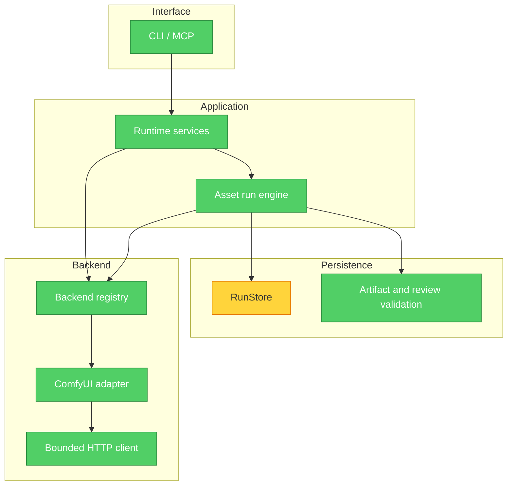

# Brooks-Lint Review

**Mode:** Architecture Audit
**Scope:** ComfyUI submission/recovery path in engine, RunStore, adapter and services; before/after `7f76f90`. 其他 bootstrap、UI、WebUI/Diffusers 未做完整架构审查。
**Health Score:** 95/100（balanced；剩余 1 Warning；仅本范围）
**Trend:** First run — no trend data

新 source 的进程恢复 seam 已补强；旧无 send marker 的活跃记录不能获得同样保证。该分数不是可靠性、SPE 适配或真实后端验证评分。

## Module Dependency Graph

callbacks 指向 engine 提供的 closure，再调用 store；adapter 不 import RunStore，因此无循环模块依赖。catalog/router/compiler/workflow 的边界仍由 engine 的既有确认检查持有；图省略低风险 collaborators。

## Findings

### Warning

**R6 Domain Model Distortion — 旧无标记记录的发送事实仍不明确**

Symptom: `RunStore._recover_stale_attempt` 在没有 job/unknown marker 时按旧逻辑回到 last_stable_state。新 callback 只保护新 source 实际经过该边界的尝试，不能证明旧 attempt 未发送。

Source: *Domain-Driven Design* — Ubiquitous Language；*A Philosophy of Software Design* — Define Errors Out of Existence。

Consequence: 对旧无 marker 的 active record 自动重入仍可能重新提交；不能把本阶段新 source 的 CPU PASS 扩展成兼容旧 uncertain attempts 的保证。

Remedy: 本验证只创建新 run，恢复旧 unmarked attempt 前必须先核验其发送证据；如未来需要支持旧 records，应设计显式 migration/quarantine 并验证，不能静默把缺 marker 解释为 no-send。原投稿快照不做 migration。

### Resolved baseline Critical findings

**R6 — 普通 ComfyUI 的已知 job 未进入 durable recovery**

Symptom: baseline engine 仅为 two-stage 注入 job callback，并仅在该分支处理 known timeout；新跨进程单阶段 probe 的 run 回到 created。

Source: *Clean Architecture* — Dependency Rule；*Domain-Driven Design* — Ubiquitous Language。

Consequence: 已接受任务超时后不能通过 run record 取得产物，且再次调用可能新发 POST。

Remedy: 三个产品文件把 same-job lifecycle 扩展到 ComfyUI 共有边界；8 个新增 probes 加既有回归验证 CPU 行为。真实后端仍待验证。

**R6 — 发送到 ID 落盘的退出窗口没有 durable uncertain state**

Symptom: baseline crash-before-binding probe 在 POST=1 后新进程得到 created。

Source: *The Pragmatic Programmer* — Design by Contract；*Code Complete* — Defensive Programming。

Consequence: 此进程退出路径没有保证 no-automatic-resubmission，不应被称为重启正确性。

Remedy: POST 前 marker，ID 后 clear unknown 并绑定 exact job；stale cleanup 保留未知。process exit 前后 probes PASS，同时保留 POST=0 false-block 负向案例。atomic replace 没有 fsync，本阶段不保证断电持久性。

## Summary

R5：依赖通过 BackendRunner/registry 和 HTTP client 组合，无本范围循环依赖；adapter 不持有 persistence。R1/R2：engine/store 规模较大，但本次只观察到生命周期知识跨三个模块传播，不凭行数另造 finding；不做重构。R3：send/job/unknown 状态集中在 store，没有另一个生产状态账本；CPU comparator 是独立研究对照。R4：新 callback 是现有 adapter 与 durable store 的 seam，没有引入额外框架。

Testability：runner、catalog、router、clock/sleep 均可注入；本次新增真实 adapter + fake HTTP + fresh subprocess 填补原 engine/adapter 分离测试的缝隙。Conway check：团队所有权信息不足，跳过，未据此推导架构缺陷。executor 自审，无独立 Agent 审计。继续工作应首先解决真实部署验证和操作者价值，不再扩大纯 fixture 或篇幅。
